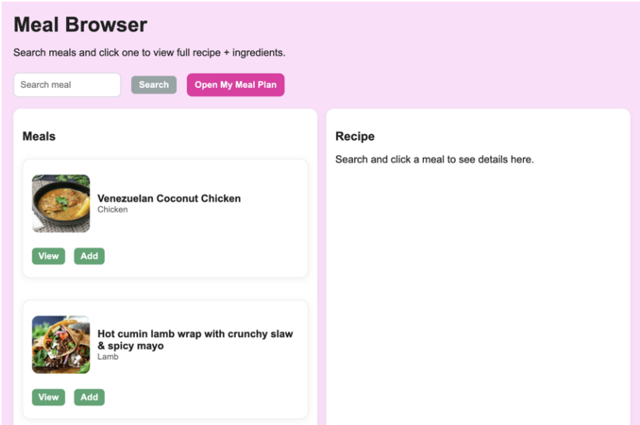
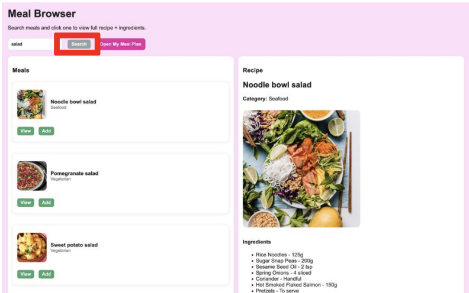
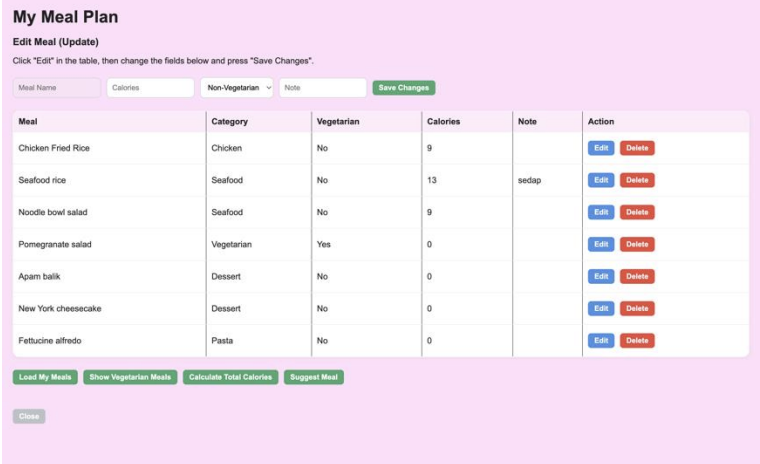

# Meal Planner Application

The Meal Planner Application is a desktop application developed using Electron, HTML, CSS, and JavaScript. It allows users to search for meal information, select meals, and organize them into a personal meal plan.

The application was developed as part of an Object-Oriented Programming project, with a focus on applying programming concepts, data manipulation, CRUD operations, and application structure.

## Features

* Search for meal information using an external API
* View meal details
* Add meals to a personal meal plan
* View saved meals
* Update meal plan information
* Delete meals from the meal plan
* Store meal plan data using JSON files
* Multi-window desktop application
* User-friendly interface for managing meals

## Technologies Used

* **Electron** – Desktop application development
* **JavaScript** – Application logic and data manipulation
* **HTML** – Application structure
* **CSS** – User interface styling
* **External API** – Meal information
* **JSON** – Local data storage

## Application Screens

Example:







## Main Functions

### Meal Search

Users can search for meals and retrieve meal information from an external API.

### Meal Planning

Users can select meals and add them to their personal meal plan.

### CRUD Operations

The application supports:

* **Create** – Add meals to the meal plan
* **Read** – View saved meals
* **Update** – Modify meal plan information
* **Delete** – Remove meals from the meal plan

### Data Storage

Meal plan information is stored locally using JSON files, allowing data to remain available after the application is closed.

## Project Structure

```text
project/
├── assets/
├── css/
├── js/
├── html/
├── data/
└── ...
```

## Getting Started

### 1. Clone the repository

```bash
git clone https://github.com/ameerahasban-oop/memoir-event-reminder
```

### 2. Open the project folder

```bash
cd meal-planner
```

### 3. Install dependencies

```bash
npm install
```

### 4. Run the application

```bash
npm start
```

## Learning Outcomes

Through this project, I gained practical experience in:

* Object-oriented programming concepts
* JavaScript programming
* Desktop application development using Electron
* CRUD operations
* Working with external APIs
* JSON file handling
* Multi-window application development
* Data manipulation and management
* User interface development

## Future Improvements

Possible future improvements include:

* User account management
* More advanced meal filtering
* Nutrition information
* Meal categories
* Weekly meal calendar
* Cloud-based data storage
* Improved meal recommendations

## Author

**Ameerah Solehah Bt Asban**

Diploma in Computer Science
Kolej Profesional MARA Beranang
